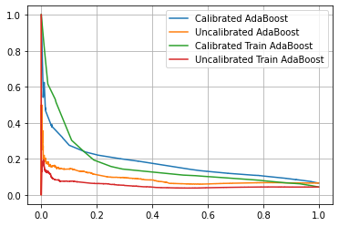
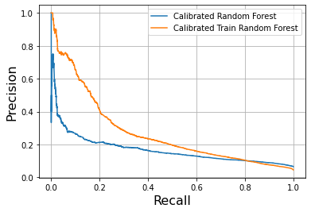
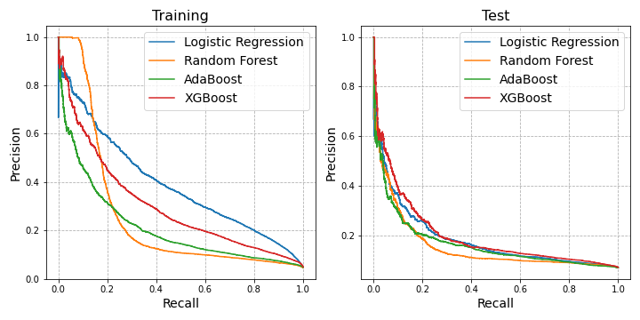

# Modeling

## Objective
Our case is a binary classification: we predict popular posts, defined as the posts with top 5% percentile of scores in each subreddit forum.

## Data Splitting
Since there may be time dependency for what posts become popular in Reddit, we split the data (into training and test sets) by time. We use Jan-Mar posts as training set and April posts as test set. Among the training dataset, we tune the hyperparameters using 
```Python 
sklearn.model_selection.TimeSeriesSplit
``` 

## Features

From our exploratory data analysis, we considered the following features as our candidates for features.

1. Title of post <br/>
2. Body of post <br/>
3. Author's name <br/>
4. Subreddit forum <br/>
5. Sentiment analysis of the title <br/>
6. Posting time: day, date, and hour <br/>
7. Whether that posts contain video/image or not <br/>
8. The length of the title <br/>
9. The number of emoji counts in the title and the body <br/>
10. The number of exclamation points and question marks in the title and the body <br/>
11. The number of uppercases in the title and the body <br/>
12. The number of tweets, likes, and retweets, and the (weighted) sentiment with specific keywords three days preceding the post submission
13. The mean upvotes of the author in the specific subreddit up to submission time.

## Evaluation Metrics

The stakeholders of this project are the traders of the firm, and we believe they will be interested in seeing high precision and/or high recall rate depending on their purposes. If a significant amount of money is involved based on the prediction outcome, then increasing the precision will be paramount. On the other hand, if only an exploration of what are potentially popular is needed, then having high recall will be more appropriate.

With that in mind, we evaluate our models based on precision-recall curves, with an emphasis for high precision. In our deployed model, the user can freely choose whether they want to be aggressive (high recall) or conservative (high precision).

# Training and Model Selection

We train the following models: logistic regression, random forest classifier, XGBoost, AdaBoost, Neural Network with Dense Layer only and Neural Network with LSTM layers. To deal with imbalance data, we modified the weight of the loss function by (100/*x*)-1, where *x* is the percentage of popular posts.
We have proposed several versions of modeling approaches, each of which yielding similar performance and has room for improvement. It suggests that the features we select may be insufficient for predicting the popularity (high bias).

## Combining the numeric data with text data
**Main Contributor: Ghanashyam Khanal**

In order to combine the numeric features with the text data we converted the numeric values to words (eg. 21 -> twenty_one) using python package [`num2words`](https://pypi.org/project/num2words/) and joined that with the text features which were then converted to numerical features for the models using various techniques as explained in the next section.

## Text Data Processing
In order to obtain the numerical features for the text data we used several text-processing methods as described below.

### TF-IDF and Bag-of-Words (BoW) 
**Main Contributor: Ghanashyam Khanal, Dyas Utomo, Shahnawaz Khalid**

We used `scikit-learns`'s `sklearn.feature_extraction.text.TfidfVectorizer` and `sklearn.feature_extraction.text.CountVectorizer` as features before training the several models (as described above). 

### Word2Vec 
**Main Contributor: Ghanashyam Khanal, Dyas Utomo**

Since the `TF-IDF` and `BoW` methods didn't have a great result we moved to `Word2Vec` method using from `gensim` package. `gensim.models.Word2Vec`. We embedded the input text data into 1000 dimensional feature space and trained Logistic regression model.

### Probability Calibration Only (Main Contributor: Kung-Ching Lin)

It is also possible to not perform any vectorization of texts and still get similar performance. In that sense, this model does not detect the context of the posts but only the general sensation (Emojis, uppercases, \!/?). After backward feature selection, we found out that the Twitter information, as well as the post sentiment, do not give any improvement on the model prediction, so we dropped those in our model.

Numerous models have been tried out, including logistic regression, decision trees, random forests, XGBoost, Adaboost, and voting classifiers. However, during early iterations, voting classifiers seemed to perform much worse than its individual parts. Our guess was that the models are not calibrated in the probability prediction.




After calibration, the PR curve jumps to almost the same level as other approaches.


## Summary

**Model Performance:** We compare the models performace using the precision-recall curves. As shown below, model perfomances are more or less similar, but XGBoost gives the best performance.


