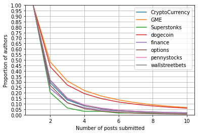

# Exploratory Data Analysis

We have done some preliminary data analysis to explore our dataset. Though nothing too concrete can be derived, we have the following observations:

## Post Types
We split the reddit posts into three categories: posts with pictures/memes, posts with external links to either news or videos, and posts with only texts. Across different subreddits, we see a big difference:

We might be able to say that subreddits with a bunch of memes are less serious and may have a different criterion than the more serious ones for popularity.
    
In terms of upvotes, there are also differences across subreddits.

Even for meme-heavy subs, text-only posts still have a better potential of being highly upvoted, which is surprising.

## By Authors

We are also interested in whether authors should be included as one of the features in our data. It is expected that most posters have only ever submitted one post, while a small amount of them are more active. Examining the trends, we have the following figure:

    
It can be seen that posters in GME and dogecoin have a much higher proportion of being highly active, with more than 5\% posters with more than 10 posts.

## Other Factors
    
We also looked into other factors such as the time of the day and the text length. There are certain periods of times where the posts have a higher upvote ratio (upvotes/downvotes), so it indicates that including it as a feature may be sensible. For text lengths, it is harder to see a trend, though longer posts tend to be more upvoted for r/options.

### Time Dependency

### Sensation Analysis

We can distinguish the types of posts by looking at some characteristics of the post: number of emojis used, number of uppercase letters, and the number of exclamation points/question marks. As they do contain information for predicting popularity, we end up including those.

It turns out that normalizing the number of exclamation points in the titles yields additional information.

