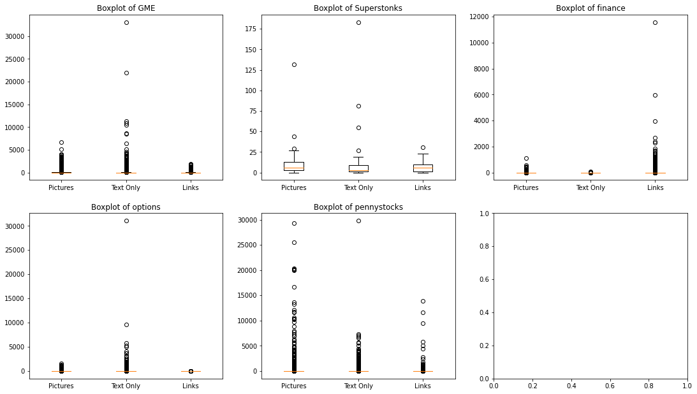

# Modeling

Our case is a binary classification: we predict popular posts, defined as the posts with top 5% percentile of scores.

We include and combine the following features into TF-IDF:
1. Title of post
2. Body of post
3. Author's name
4. Subreddit forum
5. Sentiment analysis of the title
6. Posting time: day, date, and hour
7. Whether posts contain video/image or not?
8. The length of title text
9. The number of emoji in title and body
10. The number of exclamation and question marks in title and body
11. The number of upper and lower cases in title and body

We split the data (into training and test sets) by time. We use Jan-Mar posts as training set and April posts as test set.

We train and evaluate the data using the following models:

## Logistic Regression

## Random Forest Classifier

## XGBoost

## AdaBoost
