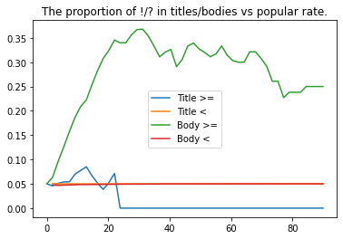

# Erdos Bootcamp 2021

# Team Members: 
- [Dyas Utomo](https://www.linkedin.com/in/dyasutomo/)
- [Ghanashyam Khanal](https://www.linkedin.com/in/ghanashyam-khanal/)
- [Kung-Ching Lin](https://www.linkedin.com/in/kung-ching-lin/)
- [Shahnawaz Khalid](https://www.linkedin.com/in/shahnawaz-khalid-252345116/)

## Introduction and Motivation

# Data Gathering

Our dataset consists of all reddit posts from January 1, 2021 to mid May across several financial subreddits. Additionally, we have gathered tweets with certain keywords as well as the stock exchange data for the ticks of interest from the same period. In the following, we will describe the data by category.


## Reddit Posts (Main Contributor: Kung-Ching Lin)

There are two main APIs for reddit posts: PRAW and Pushshift. Although there are numerous features available, we chose to keep the following ones: subreddit, author, title, post body (texts in the posts if any), external links (links to figures, videos, or external websites), submission time, and score (total upvotes minus downvotes). The list of available features can be found here: [PRAW](https://praw.readthedocs.io/en/latest/code_overview/models/submission.html), [Pushshift](https://github.com/pushshift/api).

### Trade-offs Between PRAW and Pushshift

The reason we use both APIs to obtain post information is because there are trade-offs between the two APIs. Pushshift is much quicker for data requests than PRAW but does not record real-time scores, as it maintains a copy of all reddit posts by updating continually. Thus, we needed to request information of all posts from Pushshift before retrieving the real-time score from PRAW by post ids. The corresponding file for data gathering can be found [here](https://github.com/kungchinglin/erdos_bootcamp_2021/blob/main/01_data_gathering/Data_gathering.ipynb).

### Dataset Description

We try to have a wide array of financial subreddits to see if there is any variance between them. The following table describes the number of posts we have for each subreddit. 

| Subreddit   | Number of Posts | Complete with Post Body?|
| ----------- | -----------     | ------------------- |
| r/wallstreetbets      | 954311           | No |
| r/dogecoin   | 576871        | No|
| r/CryptoCurrency   | 172461        | No|
| r/GME   | 152800        | Yes|
| r/amcstock   | 121480        | Yes|
| r/pennystocks   | 48514        | Yes|
| r/options   | 16589        | Yes|
| r/finance   | 2941        | Yes|
| r/Superstonks   | 146       | Yes|

Due to the low speed of PRAW, we were not able to complete gathering information for the top three subreddits. As such, we only worked on the subreddits with complete information.

## Twitter Data  (Main Contributor: Shahnawaz Khalid)

We used the new [Twitter API v2](https://developer.twitter.com/en/docs/twitter-api) to obtain tweets from Dec 25th 2020 to May 20th 2021. We only focused on tweets that mentioned GameStop. To reduce the volume of 'spam' tweets or tweets with no information, we only searched for tweets that had the phrase "GameStop" and either the hashtag #GME or cashtag $GME mentioned in the text. We excluded tweets that were either retweets or replies and limited our search to tweets in english.

### Data Description

Each tweet comes with public metrics; likes, retweets and replies that we used as a basis for measuring popularity. The media attachment with the tweet, if any, was also saved and classified as either an image, video or animated gif. In addition we also pulled data for each user that tweeted that included, number of followers, number of tweets, number of users following and number of lists that the user was part of. These were later used as features for our models. The total number of tweets during this time period was 72823, comprising of 30496 uinque users. 

Finally, the reason GME has been so popular is because of its rapid increase in price. Therefore we extracted stock data consisting of open, close, high, low and volume from Yahoo Finance. However, because we are mainly interested in the changes in prices, we used daily returns, volatility (standard deviation of returns over 5 day window) and variation (square of the difference between log high and log low) as features for our models. 

# Exploratory Data Analysis

We have done some preliminary data analysis to explore our dataset. Though nothing too concrete can be derived, we have the following observations:

## Post Types
We split the reddit posts into three categories: posts with pictures/memes, posts with external links to either news or videos, and posts with only texts. Across different subreddits, we see a big difference:


We might be able to say that subreddits with a bunch of memes are less serious and may have a different criterion than the more serious ones for popularity.
    
In terms of upvotes, there are also differences across subreddits.


Even for meme-heavy subs, text-only posts still have a better potential of being highly upvoted, which is surprising.

## By Authors

We are also interested in whether authors should be included as one of the features in our data. It is expected that most posters have only ever submitted one post, while a small amount of them are more active. Examining the trends, we have the following figure:


    
It can be seen that posters in GME and dogecoin have a much higher proportion of being highly active, with more than 5\% posters with more than 10 posts.

    
We also looked into other factors such as the time of the day and the text length. There are certain periods of times where the posts have a higher upvote ratio (upvotes/downvotes), so it indicates that including it as a feature may be sensible. For text lengths, it is harder to see a trend, though longer posts tend to be more upvoted for r/options.

## Time Dependency


Here, we plot out the heatmap of popularity chances with respect to hour and day. It can be seen that there are apparent hot zones for post popularities. It suggests that the submission time does matter for prediction.

## Sensation Analysis

We can distinguish the types of posts by looking at some characteristics of the post: number of emojis used, number of uppercase letters, and the number of exclamation points/question marks. As they do contain information for predicting popularity, we end up including those.




It turns out that normalizing the number of exclamation points in the titles yields additional information.


# Modeling

## Objective
Our case is a binary classification: we predict popular posts, defined as the posts with top 5% percentile of scores in each subreddit forum.

## Data Splitting
Since there may be time dependency for what posts become popular in Reddit, we split the data (into training and test sets) by time. We use Jan-Mar posts as training set and April posts as test set. Among the training dataset, we tune the hyperparameters using 
```Python 
sklearn.model_selection.TimeSeriesSplit
``` 

## Features

From our exploratory data analysis, we considered the following features as our candidates for features.

1. Title of post <br/>
2. Body of post <br/>
3. Author's name <br/>
4. Subreddit forum <br/>
5. Sentiment analysis of the title <br/>
6. Posting time: day, date, and hour <br/>
7. Whether that posts contain video/image or not <br/>
8. The length of the title <br/>
9. The number of emoji counts in the title and the body <br/>
10. The number of exclamation points and question marks in the title and the body <br/>
11. The number of uppercases in the title and the body <br/>
12. The number of tweets, likes, and retweets, and the (weighted) sentiment with specific keywords three days preceding the post submission
13. The mean upvotes of the author in the specific subreddit up to submission time.

## Evaluation Metrics

The stakeholders of this project are the traders of the firm, and we believe they will be interested in seeing high precision and/or high recall rate depending on their purposes. If a significant amount of money is involved based on the prediction outcome, then increasing the precision will be paramount. On the other hand, if only an exploration of what are potentially popular is needed, then having high recall will be more appropriate.

With that in mind, we evaluate our models based on precision-recall curves, with an emphasis for high precision. In our deployed model, the user can freely choose whether they want to be aggressive (high recall) or conservative (high precision).

## Model Selection

We have proposed several versions of modeling approaches, each of which yielding similar performance and has room for improvement. It suggests that the features we select may be insufficient for predicting the popularity (high bias).

### TF-IDF (Main Contributors: Ghanashyam Khanal, Dyas Utomo)


### Word2Vec (Main Contributors: Ghanashyam Khanal, Dyas Utomo)

### Probability Calibration Only (Main Contributor: Kung-Ching Lin)

It is also possible to not perform any vectorization of texts and still get similar performance. In that sense, this model does not detect the context of the posts but only the general sensation (Emojis, uppercases, \!/?). After backward feature selection, we found out that the Twitter information, as well as the post sentiment, do not give any improvement on the model prediction, so we dropped those in our model.

Numerous models have been tried out, including logistic regression, decision trees, random forests, XGBoost, Adaboost, and voting classifiers. However, during early iterations, voting classifiers seemed to perform much worse than its individual parts. Our guess was that the models are not calibrated in the probability prediction.


After calibration, the PR curve jumps to almost the same level as other approaches.


## Summary

**Features:** We include the following features and combine them via TF-IDF and Word2Vec:

**Training:** We train the following models: logistic regression, random forest classifier, XGBoost, and AdaBoost. To deal with imbalance data, we modified the weight of the loss function by (100/*x*)-1, where *x* is the percentage of popular posts.

**Model Performance:** We compare the models performace using the precision-recall curves. As shown below, model perfomances are more or less similar, but XGBoost gives the best performance.


# Web Application Manual

We have deployed our model on a [web app](http://gristock.herokuapp.com/) via Heroku. This web app is for predicting whether a reddit post will go viral. To use it, please input the url to the reddit post you want to predict. As of now, we have only tested on posts in selected financial subreddits, though you are welcome to try out other subreddits.

## Strategies

You can also determine your strategy in predicting post popularity. If you don't want to miss out on potentially popular posts, you may choose the strategy to be "Aggressive", which means more posts will be flagged as popular, at the expense of lower precision (More posts misclassified as popular). On the other hand, if you don't want to sift through a lot of unpopular posts, you may choose to be "Defensive". It makes sure that the precision is high, but you may miss out on other popular posts (low recall).

## Outcomes

The outcome is either "Viral" or "Non-viral". We defined viral posts as ones in the top 5 percentile of that subreddit in terms of upvotes.

## Implementation Detail

To see how the model is built, please explore the side bar on the left for more information. To see details of the implementation, please refer to our [Github](https://github.com/kungchinglin/erdos_bootcamp_2021) page.


## Future Work
